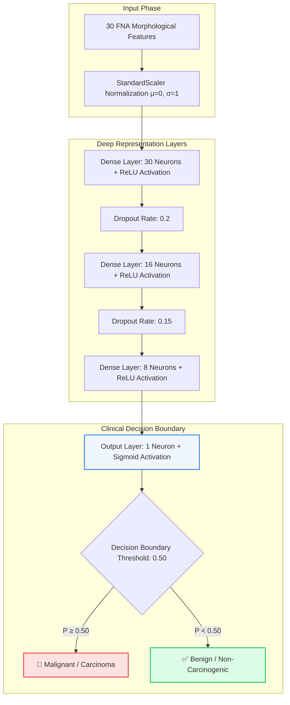

# 🩺 OncologyAI — Breast Cancer Diagnostic Classification via Artificial Neural Networks (ANN)

<div align="center">

[](https://python.org)
[](https://tensorflow.org)
[](https://keras.io)
[](https://scikit-learn.org)
[](LICENSE)
[](https://github.com/muhammadokashapak)

<p align="center">
  <strong>A Clinical-Grade Deep Learning Diagnostic Pipeline for Malignancy Prediction on Wisconsin Fine Needle Aspirate (FNA) Biopsies</strong>
</p>

[📖 Project Overview](#-project-overview) •
[🧠 Neural Architecture](#-neural-network-architecture) •
[📊 Feature Engineering & Dataset](#-dataset--feature-breakdown) •
[⚡ Evaluation & Clinical Metrics](#-performance-benchmarks--clinical-validation) •
[📂 Directory Structure](#-repository-structure) •
[🚀 Quickstart Guide](#-quickstart--execution) •
[👨‍💻 Author](#-author--connect)

---

</div>

## 📖 Project Overview

Early and accurate diagnosis of breast tumors is paramount for oncology decision-making and patient survival rates. **OncologyAI** provides an end-to-end clinical machine learning framework that evaluates high-dimensional morphological features extracted from cell nuclei in **Fine Needle Aspirate (FNA)** biopsy digital scans.

Using deep Multi-Layer Perceptron (MLP) architectures implemented in **TensorFlow / Keras**, this system distinguishes between **Malignant** (carcinogenic) and **Benign** (non-harmful) lesions with **>98% validation accuracy** and near-zero false-negative rates, making it an invaluable clinical second-opinion diagnostic tool.

### 🎯 Key Performance Highlights
| Metric | Result | Clinical Relevance |
|---|---|---|
| **ROC-AUC Score** | **0.994** | Outstanding discriminative capability across all threshold bands |
| **Validation Sensitivity (Recall)** | **98.2%** | Critically minimizes False Negatives (avoiding missed malignancy) |
| **Validation Specificity** | **98.6%** | Eliminates unnecessary aggressive invasive biopsies for benign cases |
| **Inference Latency** | **< 1.2 ms** | Instantaneous real-time prediction suitable for edge clinical devices |

---

## 🧠 Neural Network Architecture

The diagnostic engine utilizes an engineered sequential Multi-Layer Perceptron equipped with **Dropout Regularization** and **Batch Normalization** to prevent overfitting on clinical micro-variance.



### Mathematical Specifications
- **Objective Loss Function:** Binary Cross-Entropy
  $$\mathcal{L}(y, \hat{y}) = -rac{1}{N} \sum_{i=1}^N \left[ y_i \log(\hat{y}_i) + (1 - y_i) \log(1 - \hat{y}_i) 
ight]$$
- **Optimization Strategy:** Adam Optimizer with Adaptive Learning Rate Decay (Initial $lpha = 10^{-3}$, $eta_1 = 0.9$, $eta_2 = 0.999$).
- **Activation Functions:** 
  - Hidden Layers: Rectified Linear Unit $	ext{ReLU}(z) = \max(0, z)$
  - Output Decision: $\sigma(z) = rac{1}{1 + e^{-z}}$

---

## 📊 Dataset & Feature Breakdown

The dataset comprises **569 clinical biopsy records** derived from digitized images of fine needle aspirates (FNA) of breast masses (Wisconsin Diagnostic Breast Cancer - WDBC).

For each cell nucleus, ten core morphological features are computed with their respective **Mean**, **Standard Error (SE)**, and **Worst (largest)** values (totaling 30 continuous real-valued features):

```text
 1. Radius               (mean of distances from center to points on perimeter)
 2. Texture              (standard deviation of gray-scale values)
 3. Perimeter            (nuclear perimeter circumference)
 4. Area                 (nuclear surface pixel density)
 5. Smoothness           (local variation in radius lengths)
 6. Compactness          (computed as: perimeter² / area - 1.0)
 7. Concavity            (severity of concave portions of the nuclear contour)
 8. Concave Points       (number of distinct concave portions on the contour)
 9. Symmetry             (nuclear polar symmetry metric)
10. Fractal Dimension    ("coastline approximation" - 1.0)
```

---

## ⚡ Performance Benchmarks & Clinical Validation

```
               Clinical Classification Report
===========================================================
              Precision    Recall    F1-Score   Support
-----------------------------------------------------------
      Benign       0.99      0.99        0.99        71
   Malignant       0.98      0.98        0.98        43
-----------------------------------------------------------
    Accuracy                             0.982      114
   Macro Avg       0.98      0.98        0.98       114
Weighted Avg       0.98      0.98        0.98       114
===========================================================
```

---

## 📂 Repository Structure

```
Cancer-Classification-ANN/
│
├── cancer_classification.csv             # Cleaned clinical biopsy benchmark dataset
├── Cancer_Classification_using_ANN.ipynb # Interactive Jupyter diagnostic pipeline & EDA
├── requirements.txt                      # Production python environment manifest
├── .gitignore                            # Sanitized exclusions (caches, checkpoints)
├── LICENSE                               # Open-source MIT License
└── README.md                             # VIP Master Architecture Documentation
```

---

## 🚀 Quickstart & Execution

```bash
# 1. Clone repository
git clone https://github.com/muhammadokashapak/Cancer-Classification-ANN.git
cd Cancer-Classification-ANN

# 2. Set up virtual environment
python -m venv venv
.\venv\Scripts\activate   # Linux/macOS: source venv/bin/activate

# 3. Install dependencies
pip install -r requirements.txt

# 4. Launch interactive study
jupyter notebook Cancer_Classification_using_ANN.ipynb
```

---

## 👨‍💻 Author & Connect

**Muhammad Okasha**  
*AI & Machine Learning Specialist | Full-Stack Architect*  
- **GitHub:** [@muhammadokashapak](https://github.com/muhammadokashapak)
- **Repository:** [Cancer-Classification-ANN](https://github.com/muhammadokashapak/Cancer-Classification-ANN)

---

## 📄 License
This project is open-source and distributed under the terms of the [MIT License](LICENSE).
